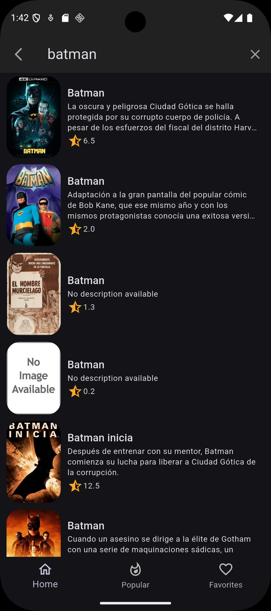
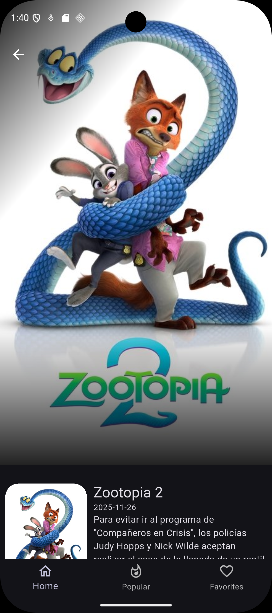
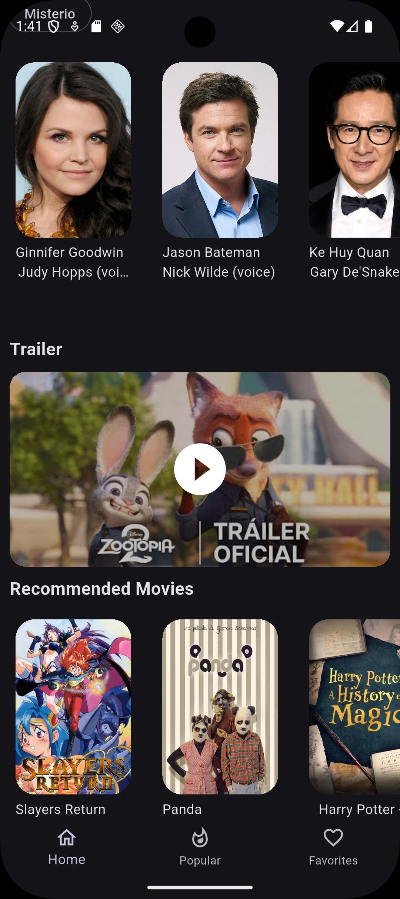

# Flutter Cinemapedia

Aplicación Flutter para explorar películas: búsqueda, listados y detalles.

**Descripción:**

Flutter Cinemapedia es una app demostrativa construida con Flutter que permite buscar y explorar información de películas, ver detalles y reproducir trailers. Está pensada como referencia para arquitecturas limpias con separación por capas (domain, infrastructure, presentation).

**Capturas:**

**Capturas (galería 2x2):**

<div align="center">
  <table>
    <tr>
      <td align="center" style="padding:8px">
        
        <div><strong>Pantalla principal</strong></div>
      </td>
      <td align="center" style="padding:8px">
        
        <div><strong>Búsqueda de películas</strong></div>
      </td>
    </tr>
    <tr>
      <td align="center" style="padding:8px">
        
        <div><strong>Detalle (1)</strong></div>
      </td>
      <td align="center" style="padding:8px">
        
        <div><strong>Detalle (2)</strong></div>
      </td>
    </tr>
  </table>
</div>

**Requisitos**:

- Flutter SDK (recomendado: canal estable). Versión Dart indicada en `pubspec.yaml`: `^3.9.2`.
- Android Studio / Visual Studio Code (opcional).

**Instalación y ejecución (PowerShell / Windows)**:

```powershell
# Instalar dependencias
flutter pub get

# Ejecutar en el dispositivo conectado o emulador
flutter run -d <deviceId>

# Ejemplos:
flutter run -d windows      # Ejecutar en Windows (si está habilitado)
flutter run -d emulator-5554 # Ejecutar en un emulador Android

# Generar APK
flutter build apk
```

**Dependencias principales** (extraídas de `pubspec.yaml`):

- `animate_do` — animaciones fáciles.
- `card_swiper` — carrusel/swiper de tarjetas.
- `dio` — cliente HTTP.
- `flutter_dotenv` — variables de entorno (.env).
- `flutter_riverpod` — gestión de estado.
- `go_router` — navegación basada en rutas.
- `intl` — internacionalización y formatos.
- `url_launcher` — abrir enlaces externos.
- `video_thumbnail` — generar miniaturas de video.
- `youtube_player_flutter` — reproductor de YouTube integrado.

**Estructura del proyecto (resumen)**:

- `lib/` — código fuente principal.
  - `domain/` — entidades, repositorios, casos de uso.
  - `infrastructure/` — datasource, mappers, modelos.
  - `presentation/` — screens, views, widgets y rutas.
  - `config/` — constantes, helpers, router y tema.
- `assets/` — imágenes y loaders (en este repositorio hay `assets/images/` con capturas).
- `android/`, `ios/`, `web/`, `windows/`, `linux/`, `macos/` — configuración por plataforma.

**Notas sobre assets (importante)**:

Las capturas están en `assets/images/` dentro del repositorio. En el `pubspec.yaml` actual solo figura `assets/loaders/` y `.env`. Para asegurarte de que Flutter incluya las imágenes en la compilación añade lo siguiente bajo la sección `flutter:` en `pubspec.yaml`:

```yaml
flutter:
  assets:
    - .env
    - assets/loaders/
    - assets/images/
```

Después corre `flutter pub get`.

**Arquitectura y decisiones**:

- Separación por capas (domain/infrastructure/presentation) para mantener el código testeable y modular.
- `Riverpod` se utiliza para la gestión de estado por su integración con providers y escalabilidad.
- `Dio` para llamadas HTTP y manejo de interceptores.
